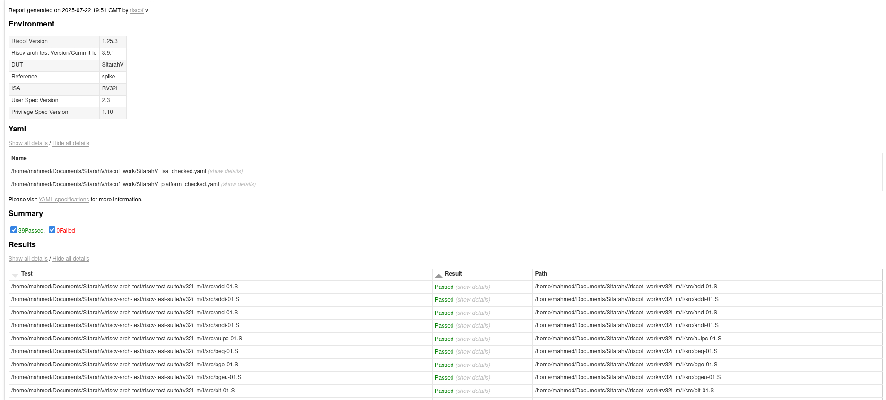
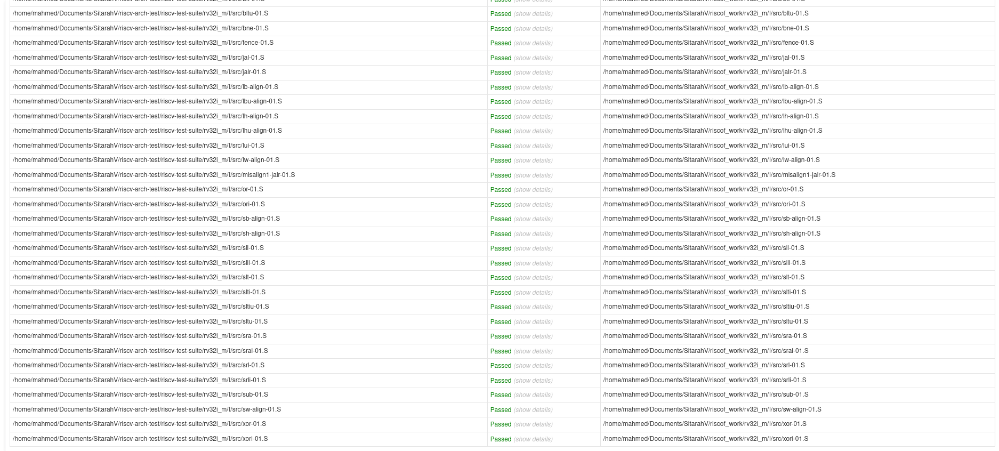

# 🚀 RV32I 5-Stage Pipelined Processor (SystemVerilog Implementation)

This project implements a **5-stage pipelined datapath** for the **RV32I subset** of the **RISC-V Instruction Set Architecture**, using **SystemVerilog**. It models a realistic CPU pipeline with instruction-level parallelism and is fully compliant with the RISC-V standard, verified using **RISCOF compliance tests**.

---

## 🧠 Project Overview

- 🖥️ **Architecture**: RISC-V RV32I base ISA (Integer-only, 32-bit)
- 🏗️ **Pipeline Stages**: IF, ID, EX, MEM, WB
- 💻 **Language**: SystemVerilog
- ✅ **RISCOF Compliance**: Passed all tests
- 🧪 **Verification**: Testbenches for individual modules and full pipeline

---

## 🧩 Core Components

- **Instruction Fetch (IF)**: Fetches the next instruction from instruction memory.
- **Instruction Decode (ID)**: Decodes instruction, reads register operands, and generates control signals.
- **Execute (EX)**: Performs ALU operations, calculates memory addresses, and determines branch decisions.
- **Memory Access (MEM)**: Loads and stores data from/to data memory.
- **Write Back (WB)**: Writes result back to the register file.
- **Hazard Detection and Forwarding Units**: To resolve data hazards and ensure correct execution.

---

## ✅ Supported Instructions

This processor implements all **RV32I base instructions**, including:

- **R-type**: `add`, `sub`, `sll`, `slt`, `sltu`, `xor`, `srl`, `sra`, `or`, `and`  
- **I-type**: `addi`, `andi`, `ori`, `xori`, `slti`, `sltiu`, `slli`, `srli`, `srai`, `lw`, `lb`, `lh`, `lbu`, `lhu`, `jalr`  
- **S-type**: `sw`, `sb`, `sh`  
- **B-type**: `beq`, `bne`, `blt`, `bge`, `bltu`, `bgeu`  
- **U-type**: `lui`, `auipc`  
- **J-type**: `jal`

---

## ✅ RISC-V Compliance (RISCOF)

This processor design has passed **all RISCOF compliance tests** for the **RV32I** ISA.

📸 **Screenshot Proof**:  

